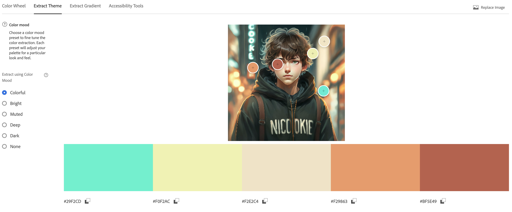

# ПЗ-11 Дослідження кольорових гармоній та інструментів аналізу кольору в Adobe Color

## Виконав:

**Лапін Микита**  
**Група: ІПЗ-2.03**

---

Усі файли доступні в репозиторії на [GitHub](https://github.com/ni-cookie/UXUIuniversity/tree/main).

---

## Теоретична частина

**Кольорова гармонія** — поєднання кольорів, яке створює естетично приємне враження. Використовується в дизайні для досягнення візуального балансу та емоційного впливу.

**Типи кольорової гармонії:**

- **Analogous (аналогічна):** поєднання сусідніх кольорів на колірному колесі.
- **Monochromatic (монохроматична):** використання відтінків одного кольору.
- **Triad (тріада):** три кольори, рівновіддалені на колірному колесі.
- **Complementary (комплементарна):** поєднання протилежних кольорів.
- **Split Complementary (розділена комплементарна):** базовий колір і два сусідні до його комплементарного.
- **Square (квадратна):** чотири кольори, рівновіддалені на колірному колесі.
- **Custom (власна побудова):** довільне поєднання кольорів за власним вибором.

**Колірні моделі:**

- **RGB:** основна модель для екранів.
- **HSB:** визначає колір через відтінок, насиченість та яскравість.
- **LAB:** модель, що наближена до сприйняття кольору людиною.

**Контрастність та WCAG:**

- **AA:** мінімум 4.5:1 для звичайного тексту, 3:1 для великого.
- **AAA:** мінімум 7:1 для звичайного, 4.5:1 для великого.

## Практична частина

### 1. Робота з колірним колесом

**Базовий колір:** `#3498db`

#### Analogous

- **Скрін з сайту:** 
- **Опис:** Створює спокійний настрій.

#### Monochromatic

- **Скрін з сайту:** 
- **Опис:** Єдність, стриманість.

#### Triad

- **Скрін з сайту:** 
- **Опис:** Контраст і гармонія.

#### Complementary

- **Скрін з сайту:** 
- **Опис:** Акцент, динамічність.

#### Split Complementary

- **Скрін з сайту:** 
- **Опис:** Збалансований контраст.

#### Square

- **Скрін з сайту:** 
- **Опис:** Яскравий, насичений вигляд.

#### Custom

- **Скрін з сайту:** 
- **Опис:** Унікальність і свобода.

### 2. Extract Theme

- **Скрін з сайту (Colorful):** 
- **Скрін з сайту (Muted):** 
- **Опис:** Muted краще для UI — менш нав’язлива.

### 3. Extract Gradient

- **Скрін з сайту:** 
- **Опис:** Плавний перехід, естетика.

### 4. Accessibility Tools

- **Скрін з сайту:** 
- **Кольори:** текст — `#ffffff`, фон — `#386aab`
- **Контраст:** 5.5:1
- **Проходить:** AA для звичайного, AAA для великого тексту.

## Висновки

Під час дослідження інструментів **Adobe Color** та вивчення кольорових гармоній були здобуті такі практичні знання:

### 1. Гармонії кольорів

- **Analogous**, **Monochromatic**, **Split Complementary** — створюють збалансовані, спокійні палітри, що добре підходять для інтерфейсів.
- **Complementary** і **Triad** — виразні, контрастні поєднання. Добре працюють для акцентів, але потребують обережності.
- **Square** та **Custom** — підходять для креативних, неформальних рішень.

### 2. Extract Theme

- Варіант **Muted** більше підходить для UI: спокійний, не відволікає увагу.
- Варіант **Colorful** доречний у креативних або дитячих інтерфейсах.

### 3. Extract Gradient

- Градієнт з трьома точками (Gradient Stops = 3) створює плавний перехід між кольорами, додає візуальної глибини.

### 4. Перевірка доступності (WCAG 2.1)

- **Текстовий колір:** `#ffffff`
- **Колір фону:** `#3498db`
- **Коефіцієнт контрастності:** `5.5 : 1`

**Результати:**

- **Regular Text (до 17pt):** Pass (рівень **AA**)
- **Large Text (від 18pt або 14pt жирний):** Pass (рівень **AAA**)
- **Graphic Components (іконки, кнопки):** Pass

### Загальний висновок

Для інтерфейсного дизайну найкраще підходять гармонії типу **Analogous**, **Monochromatic**, а також палітри у стилі **Muted**, які забезпечують візуальний комфорт. Використання кольорових поєднань, що відповідають стандарту **WCAG 2.1**, гарантує хорошу читабельність і доступність для всіх категорій користувачів.

---

Усі файли доступні в репозиторії на [GitHub](https://github.com/ni-cookie/UXUIuniversity/tree/main).

---
