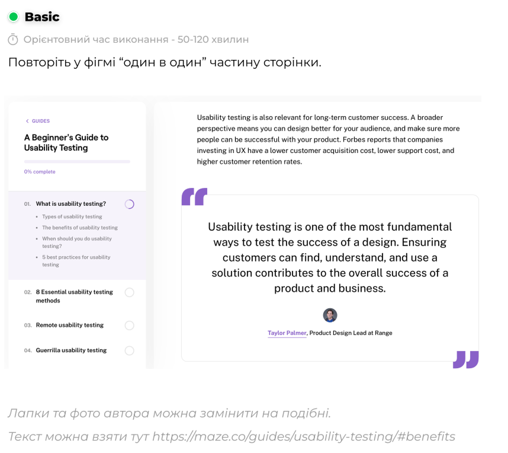

# ПЗ-8 Робота з макетами - Завдання для самостійного опрацювання

## Виконав:

**Лапін Микита**  
**Група: ІПЗ-2.03**

---

Усі файли доступні в репозиторії на [GitHub](https://github.com/ni-cookie/UXUIuniversity/tree/main).

---

## Результати

| Елемент             | Результат                 |
| ------------------- | ------------------------- |
| Референс            |      |
| **Виконана робота** | **** |

Посилання на проєкт у [Figma](https://www.figma.com/design/d1m94QnKSd68HwL9gogxDF/workshop_8?node-id=0-1&t=3JO4IVbtVylRooMk-1)

---

Усі файли доступні в репозиторії на [GitHub](https://github.com/ni-cookie/UXUIuniversity/tree/main).

---
